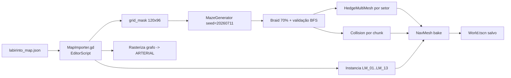

# THE LABYRINTH — Especificação Técnica de Mapa (Level Layout Spec)

**Versão:** 1.0
**Autor:** Game Design / Arquitetura de Software
**Engine alvo:** Godot 4.x (3D, 1 unidade = 1 metro)
**Escopo:** Layout completo em coordenadas, dimensões de todos os objetos, grafo de caminhos, eventos raros e convenções de implementação.
**Status:** Baseline aprovável. Tudo que não estava explícito no mapa-arte foi **assumido** e está marcado com `[A]` na seção 14.

---

## 1. Convenções de Coordenadas

### 1.1 Sistema de eixos (Godot)

| Eixo | Direção no mundo | Direção no mapa (arte) |
|---|---|---|
| `+X` | Leste | direita |
| `-X` | Oeste | esquerda |
| `+Z` | Sul | para baixo |
| `-Z` | **Norte** (frente padrão do player) | para cima |
| `+Y` | Cima (altura) | — |

> Godot usa Y-up e "frente" = `-Z`. O player entra pelo sul e caminha para o **norte (`-Z`)**. Isso alinha o forward padrão do `CharacterBody3D` com a direção de progressão.

### 1.2 Grade (grid)

- **Célula base:** `2.0 m × 2.0 m` (planta). Altura é uma propriedade separada.
- **Grade total:** `120 × 96 células` = **240 m (X) × 192 m (Z)** = 46.080 m².
- **Origem:** `(0, 0, 0)` no canto **Noroeste** do terreno. Plano do chão em `Y = 0`.
- **Indexação:** `(cx, cz)` com `cx ∈ [0..119]` (O→L) e `cz ∈ [0..95]` (N→S).

### 1.3 Conversões (usar sempre estas funções)

```gdscript
const CELL := 2.0
const GRID_W := 120
const GRID_H := 96

static func cell_to_world_center(cx: int, cz: int) -> Vector3:
    return Vector3(cx * CELL + CELL * 0.5, 0.0, cz * CELL + CELL * 0.5)

static func cell_to_world_corner(cx: int, cz: int) -> Vector3:
    return Vector3(cx * CELL, 0.0, cz * CELL)

static func world_to_cell(p: Vector3) -> Vector2i:
    return Vector2i(int(floor(p.x / CELL)), int(floor(p.z / CELL)))
```

> **Regra de ouro:** todos os *landmarks* deste documento são especificados em **metros (world)**. Os corredores e sebes são especificados em **células**. Coordenadas world de landmarks caem sempre em múltiplos de 2 m (cantos de célula) para facilitar o snap.

### 1.4 Larguras de caminho

| Tipo | Sigla | Células | Largura | Uso |
|---|---|---|---|---|
| Caminho Principal | `CP` | 2 | **4,0 m** | Alamedas arteriais, pavimento claro |
| Caminho Secundário | `CS` | 1 | **2,0 m** | Ramais, anel perimetral, cascalho |
| Beco / Sem Saída | `BC` | 1 | **2,0 m** | Cul-de-sac (armadilhas / loot) |
| Atalho / Conexão | `AT` | 1 | **2,0 m** | Brecha oculta na sebe, revela-se por inspeção |

---

## 2. Camadas de Altura (Y)

| Elemento | Altura (Y) | Espessura / Base | Observação |
|---|---|---|---|
| **Sebe da Entrada** (Setor A) | **2,00 m** | 2,0 m (1 célula) | Zona-tutorial: o player quase enxerga por cima. Tensão baixa. |
| **Sebe Geral** (todos os outros setores) | **3,00 m** | 2,0 m (1 célula) | Oclusão total (olho do player = 1,65 m). |
| Sebe rala (marca de atalho `AT`) | 3,00 m | 2,0 m | Mesh distinto + material com "vãos"; colisão removida ao ser descoberta. `[A]` |
| Muro perimetral de pedra | **4,50 m** | 2,0 m (1 célula) | Contorno externo do mapa, intransponível. `[A]` |
| Muro do Jardim das Rosas | **2,50 m** | 0,40 m | Tijolo aparente. `[A]` |
| Arco de Conexão entre Áreas | 5,00 m (topo) | vão 4,0 m | Ver §9. |
| Portal de Entrada (nº 1) | 4,80 m (topo) | vão 4,0 m | Ver §5.1. |
| Portão Final (nº 13) | 6,50 m (topo) | vão 6,0 m | Ver §5.13. |
| Torre do Relógio (nº 11) | **28,00 m** | base 10×10 m | Landmark global de orientação. |

**Malha visual da sebe (para o artista/MultiMesh):**
- Colisão: `BoxShape3D` de `2,0 × H × 2,0` centrada na célula, com origem em `Y = H/2`.
- Mesh: `1,8 × H × 1,8` (folga de 0,1 m por lado → junta orgânica entre células, evita z-fighting).
- Variação procedural por instância: rotação Y ∈ {0°,90°,180°,270°}, escala Y ∈ [0,96 .. 1,04], jitter XZ ≤ 0,06 m.

---

## 3. Setores (Sectors) — particionamento lógico

Usados para: altura de sebe, densidade de névoa, mixagem de áudio, streaming e save-checkpoints.

| ID | Nome | Células `cx` | Células `cz` | World X | World Z | Sebe | Névoa (dens.) |
|---|---|---|---|---|---|---|---|
| `SEC_A` | Entrada Sul | 2–35 | 80–94 | 4–72 | 160–190 | **2,0 m** | 0,010 |
| `SEC_B` | Mausoléu Oeste | 2–35 | 60–79 | 4–72 | 120–160 | 3,0 m | 0,018 |
| `SEC_C` | Claustro | 2–35 | 36–59 | 4–72 | 72–120 | 3,0 m | 0,015 |
| `SEC_D` | Lago Norte | 2–35 | 2–35 | 4–72 | 4–72 | 3,0 m | 0,015 |
| `SEC_E` | Ciprestes | 36–70 | 2–29 | 72–142 | 4–60 | 3,0 m | 0,020 |
| `SEC_F` | Rosas & Bosque | 71–117 | 2–35 | 142–236 | 4–72 | 3,0 m | 0,030 (Bosque) |
| `SEC_G` | Praça Central | 36–70 | 30–65 | 72–142 | 60–132 | 3,0 m | 0,012 |
| `SEC_H` | Gazebo & Estufa | 71–117 | 36–70 | 142–236 | 72–142 | 3,0 m | 0,016 |
| `SEC_I` | Fonte & Sombras | 36–70 | 66–94 | 72–142 | 132–190 | 3,0 m | 0,035 (Sombras) |
| `SEC_J` | Labirinto Sudeste | 71–117 | 71–94 | 142–236 | 142–190 | 3,0 m | 0,022 |

Anel de células `cx ∈ {0,1,118,119}` e `cz ∈ {0,1,94,95}` = **muro perimetral + faixa técnica** (não navegável, exceto aberturas dos portões e da Torre).

---

## 4. Tabela Mestre dos 13 Locais

Coordenadas = **centro do local**, em metros world. `Y` do piso quando ≠ 0.

| # | Local | Centro (X, Z) | Célula (cx, cz) | Footprint (X×Z) | Altura máx. | Y do piso | Setor |
|---|---|---|---|---|---|---|---|
| 1 | **Entrada (Portão)** | (28, 188) | (14, 94) | 12 × 10 m | 4,80 m | 0,00 | SEC_A |
| 2 | **Praça das Quatro Estátuas** | (104, 72) | (52, 36) | Ø 32 m (círculo) | 3,60 m | 0,00 | SEC_G |
| 3 | **Lago Seco** | (48, 46) | (24, 23) | 40 × 40 m (anel) | 0,90 m | **−1,80** (fundo) | SEC_D |
| 4 | **Jardim das Rosas** | (166, 30) | (83, 15) | 32 × 24 m | 2,60 m | 0,00 | SEC_F |
| 5 | **Bosque Morto** | (208, 38) | (104, 19) | 44 × 48 m | 9,00 m | 0,00 | SEC_F |
| 6 | **Gazebo Antigo** | (190, 78) | (95, 39) | Ø 30 m (clareira) | 5,65 m | **+0,45** (deck) | SEC_H |
| 7 | **Estufa** | (162, 110) | (81, 55) | 24 × 32 m | 9,00 m | 0,00 | SEC_H |
| 8 | **Claustro Verde** | (40, 104) | (20, 52) | 30 × 30 m | 4,40 m | 0,00 | SEC_C |
| 9 | **Fonte Principal** | (104, 118) | (52, 59) | Ø 28 m (círculo) | 4,20 m | 0,00 | SEC_I |
| 10 | **Mausoléu** | (54, 154) | (27, 77) | 22 × 16 m (+adro) | 9,00 m | **+0,60** (estilóbata) | SEC_B |
| 11 | **Torre do Relógio** | (114, 6) | (57, 3) | 10 × 10 m | **28,00 m** | 0,00 | SEC_E |
| 12 | **Jardim das Sombras** | (114, 158) | (57, 79) | 36 × 28 m | 2,60 m | 0,00 | SEC_I |
| 13 | **Portão Final (Saída)** | (114, 188) | (57, 94) | 20 × 12 m | 6,50 m | 0,00 | SEC_I |
| LM-A | *Alameda dos Ciprestes* (marco) | (80, 26) | (40, 13) | 4 × 42 m | 8,00 m | 0,00 | SEC_E |

**Bounding boxes ocupadas (para o gerador de labirinto reservar as células):**

| # | X mín–máx | Z mín–máx | Células reservadas `cx` | `cz` |
|---|---|---|---|---|
| 1 | 22 – 34 | 178 – 190 | 11–17 | 89–94 |
| 2 | 88 – 120 | 56 – 88 | 44–59 | 28–43 |
| 3 | 28 – 68 | 26 – 66 | 14–33 | 13–32 |
| 4 | 150 – 182 | 18 – 42 | 75–90 | 9–20 |
| 5 | 186 – 230 | 14 – 62 | 93–114 | 7–30 |
| 6 | 175 – 205 | 63 – 93 | 87–102 | 31–46 |
| 7 | 146 – 178 | 88 – 134 | 73–88 | 44–66 |
| 8 | 25 – 55 | 89 – 119 | 12–27 | 44–59 |
| 9 | 90 – 118 | 104 – 132 | 45–58 | 52–65 |
| 10 | 41 – 67 | 140 – 162 | 20–33 | 70–80 |
| 11 | 107 – 121 | 0 – 21 | 53–60 | 0–10 |
| 12 | 96 – 132 | 144 – 172 | 48–65 | 72–85 |
| 13 | 104 – 124 | 176 – 190 | 52–61 | 88–94 |

---

## 5. Especificação Detalhada dos Locais

> Todas as medidas em metros. `Ø` = diâmetro. Cada local vira uma **cena Godot instanciável** (`res://levels/labyrinth/landmarks/LM_XX_Nome.tscn`) com origem no **centro** listado na §4.

### 5.1 — 01 · ENTRADA (PORTÃO) — `(28, 188)`

| Elemento | Dimensões (L × P × A) | Posição relativa ao centro | Qtd |
|---|---|---|---|
| Pilar do portal (pedra) | 1,2 × 1,2 × 4,0 | (−2,6, 0) e (+2,6, 0) | 2 |
| Lintel / arco | 6,4 × 0,8 × 0,8 | (0, 0), Y=4,0 | 1 |
| Folha de portão (ferro) | 2,0 × 0,08 × 3,2 | (±1,0, 0), Y=0 | 2 |
| Lanterna de pilar | 0,30 × 0,30 × 0,55 | topo dos pilares, Y=2,2 | 2 |
| Átrio pavimentado | 12,0 × 10,0 × 0,02 | (0, −4) | 1 |
| Placa/mapa enferrujado | 1,00 × 0,05 × 1,60 | (+5, −4), rot Y = −20° | 1 |
| Vaso quebrado | Ø0,5 × 0,6 | (−5, −6) | 2 |

- **Spawn do player:** `Vector3(28.0, 0.0, 186.5)`, rotação Y = **180°** (olhando para `-Z`, norte).
- Abertura no muro perimetral: vão de **4,0 m** centrado em `X = 28`, `Z = 190`.
- Sebe do setor: **2,0 m** (o player enxerga a Torre do Relógio ao longe → *hook* inicial de orientação).

### 5.2 — 02 · PRAÇA DAS QUATRO ESTÁTUAS — `(104, 72)`

| Elemento | Dimensões | Posição | Qtd |
|---|---|---|---|
| Piso circular (pedra radial) | Ø 28,0 × 0,05 | (0,0) | 1 |
| Anel de sebe | r int. 14,0 / r ext. 16,0, A 3,0 | anel | 1 |
| Aberturas no anel | 4,0 de vão, alinhadas às radiais | 8× (0°,45°,…,315°) | 8 |
| **Pedestal de estátua** | 1,6 × 1,6 × 1,2 | r = 8,0 nos ângulos 45/135/225/315° | 4 |
| **Estátua** (encapuzada) | Ø 0,9 × 2,4 (topo Y = 3,6) | sobre o pedestal | 4 |
| Relógio de sol central | Ø 2,4 × 0,40 base + gnômon 1,60 | (0,0) | 1 |
| Banco de pedra | 1,80 × 0,50 × 0,45 | r = 11,0 em N/L/S/O | 4 |
| Lampião de poste | Ø 0,18 × 3,20 (luz Y=3,0) | r = 12,5 nas diagonais | 4 |

**Coordenadas world das 4 estátuas** (offset 8,0 m a 45°):

| ID | Ângulo | World (X, Z) | Olhando para |
|---|---|---|---|
| `ST_NE` | 45° | (109.66, 66.34) | centro |
| `ST_SE` | 135° | (109.66, 77.66) | centro |
| `ST_SO` | 225° | (98.34, 77.66) | centro |
| `ST_NO` | 315° | (98.34, 66.34) | centro |

**Bocas das 8 radiais (ponto onde a sebe abre, r = 16):**
`N (104, 56)` · `NE (115.3, 60.7)` · `L (120, 72)` · `SE (115.3, 83.3)` · `S (104, 88)` · `SO (92.7, 83.3)` · `O (88, 72)` · `NO (92.7, 60.7)`

### 5.3 — 03 · LAGO SECO — `(48, 46)`

| Elemento | Dimensões | Posição | Qtd |
|---|---|---|---|
| Bacia elíptica (seca) | 28,0 (X) × 22,0 (Z), prof. **1,80** | (0,0), fundo em Y = −1,80 | 1 |
| Talude / parede da bacia | inclinação 60°, faixa 2,0 | perímetro da bacia | — |
| Balaustrada de pedra | elipse 32 × 26, 0,30 esp. × **0,90** alt. | perímetro | 1 |
| Aberturas na balaustrada | 3,0 de vão | N, S, L, O | 4 |
| **Ponte Seca** (passarela) | 30,0 × 3,0 × 0,35 | eixo L–O, Y = +0,05 | 1 |
| Escada de descida | 3,0 × 2,0, 6 degraus × 0,30 | lado sul, (0, +9) | 1 |
| Anel de caminho externo (`CS`) | círculo r = 19,0, larg. 2,0 | — | 1 |
| Banco de pedra | 1,80 × 0,50 × 0,45 | r = 17,5 (NE, SO, SE) | 3 |
| Fundo rachado (decal + mesh) | 28 × 22 | Y = −1,80 | 1 |

**Bocas do anel (r = 20):** `N (48, 26)` · `S (48, 66)` · `L (68, 46)` · `O (28, 46)`

### 5.4 — 04 · JARDIM DAS ROSAS — `(166, 30)`

| Elemento | Dimensões | Posição | Qtd |
|---|---|---|---|
| Muro de tijolo | perímetro 32 × 24, esp. **0,40**, alt. **2,50** | — | 1 |
| Portão único (sul) | vão 3,0 × alt. 3,20 (arco) | (0, +12) | 1 |
| Canteiro quadrado | 8,0 × 8,0, borda 0,25 × 0,30 | (±6,5, ±5,5) | 4 |
| Cruz de caminhos | 2,0 de largura | eixos centrais | — |
| Pérgola central | 6,0 × 6,0 × **2,60**, 12 colunas Ø0,20 | (0, 0) | 1 |
| Roseira (arbusto) | Ø 0,9 × 1,20 | 9 por canteiro (grade 3×3, passo 2,4) | 36 |
| Banco de ferro | 1,50 × 0,45 × 0,90 | (0, ±9) | 2 |
| **Brecha no muro oeste** (`AT-02`) | vão 1,2 × 2,0 | (−16, −4) → world (150, 26) | 1 |

> **Design note:** entrada única + brecha oculta = câmara de tensão. Alto valor de loot, alta chance de encurralamento.

### 5.5 — 05 · BOSQUE MORTO — `(208, 38)`

| Elemento | Dimensões | Regra de posicionamento | Qtd |
|---|---|---|---|
| Área (sem sebes) | 44 (X) × 48 (Z) | X 186–230, Z 14–62 | — |
| Árvore morta A | tronco Ø 0,35–0,45, alt. 6,0–7,5 | Poisson disk, raio mín. 2,6 m | ~48 |
| Árvore morta B (grande) | tronco Ø 0,55–0,65, alt. 8,0–9,0 | Poisson disk, raio mín. 4,0 m | ~18 |
| Tronco caído | 5,0 × Ø 0,5 | manual (3 posições, bloqueiam linha de visão) | 3 |
| Trilha de terra (spline) | largura 1,5–2,0 | 3 trilhas serpenteantes, não-grid | 3 |
| Pedra tombada (marco) | 2,40 × 1,20 × 0,60 | (208, 38) — centro | 1 |
| Ponto de spawn de corvo | — | galhos, Y = 4,0–7,0 | 8 |
| Névoa local | densidade ×1,5, alcance 22 m | volume 44×48×10 | 1 |

- **Entradas:** oeste `(186, 50)` e sul `(190, 62)` (vindo do Gazebo).
- Chão: material `terra_folhas`, sem navmesh de grade → **navmesh baked livre**.

### 5.6 — 06 · GAZEBO ANTIGO — `(190, 78)`

| Elemento | Dimensões | Posição | Qtd |
|---|---|---|---|
| Clareira pavimentada | Ø 26,0 (r = 13) | (0,0) | 1 |
| Anel de sebe | r int. 13,0 / ext. 15,0, alt. 3,0 | — | 1 |
| Aberturas do anel | 3,0 de vão | N, S, L, O | 4 |
| **Deck do gazebo** (octógono) | Ø circ. **8,00** (lado 3,06), alt. **0,45** | (0,0) | 1 |
| Degraus de acesso | 3,0 larg., 3 × 0,15 | N, S, L, O | 4 |
| Coluna | Ø 0,25 × 3,00 | 8 vértices do octógono | 8 |
| Telhado cônico | Ø 9,2 × 2,20 (topo Y = **5,65**) | Y = 3,45 | 1 |
| Banco corrido perimetral | 0,40 prof. × 0,45 alt. | 7 lados (1 é o acesso) | 7 |
| **Cadeira de vime** (evento raro) | 0,60 × 0,60 × 1,00 | (+1,4, +0,8), Y = 0,45 | 1 |
| Mesa de ferro | Ø 0,80 × 0,72 | (0, 0), Y = 0,45 | 1 |

**Bocas (r = 15):** `N (190, 63)` · `S (190, 93)` · `L (205, 78)` · `O (175, 78)`

### 5.7 — 07 · ESTUFA — `(162, 110)`

| Elemento | Dimensões | Posição | Qtd |
|---|---|---|---|
| Edifício (envelope) | **24,0 (X) × 32,0 (Z)**, pé-direito 5,0, cumeeira **9,00** | X 150–174, Z 94–126 | 1 |
| Nervura de ferro (arco) | perfil 0,15 × 0,15, vão 24 m | passo 2,0 m no eixo Z | 16 |
| Painel de vidro | 1,20 × 2,00 × 0,01 | grade nas fachadas + telhado | ~240 |
| Painéis já quebrados | — | 30% aleatório (seed fixa) | ~72 |
| Porta dupla (norte) | vão 2,40 × 3,00 | (162, 94) | 1 |
| Porta de serviço (sul) | 1,00 × 2,20 | (162, 126) | 1 |
| Bancada de plantio | 6,00 × 1,20 × 0,90 | 3 por lado, passo Z = 9,0 | 6 |
| Corredor central | 3,0 de largura | eixo Z | — |
| Vaso de barro | Ø 0,35 × 0,40 | sobre bancadas | ~40 |
| Samambaia morta | Ø 0,6 × 0,7 | sobre bancadas | ~24 |
| Calçada externa | faixa de 4,0 m em volta | perímetro | 1 |
| Adro norte | 12,0 × 6,0 | (162, 91) | 1 |
| Adro sul | 8,0 × 4,0 | (162, 130) | 1 |

> **Iluminação:** única área com *light shafts* volumétricos. Interior é o melhor esconderijo do mapa (`AI hearing radius` reduzido em 40% dentro do volume). `[A]`

### 5.8 — 08 · CLAUSTRO VERDE — `(40, 104)`

| Elemento | Dimensões | Posição | Qtd |
|---|---|---|---|
| Envelope externo | **30,0 × 30,0** | X 25–55, Z 89–119 | 1 |
| Galeria coberta (arcada) | profundidade **5,00**, altura útil 3,80, telhado até **4,40** | 4 lados | 1 |
| Coluna da arcada | Ø 0,35 × 2,80 (+ arco 1,00) | 10 por lado, passo 2,5 m | 40 |
| Parede externa | esp. 0,50 × alt. 4,40 | perímetro | 1 |
| **Garth** (jardim interno) | 20,0 × 20,0 | (0,0) | 1 |
| Cruz de caminhos (garth) | largura 1,50 | eixos | — |
| Canteiro | 8,50 × 8,50, borda 0,20 | 4 quadrantes | 4 |
| Poço octogonal | Ø 1,60 × **0,80** (+ arco de ferro 2,2) | (0,0) | 1 |
| **Nicho de vela** | 0,30 × 0,20 × 0,45, Y = 1,40 | 3 por lado na parede interna | 12 |
| Vela (evento raro) | Ø 0,05 × 0,18 | dentro dos nichos | 12 |
| Lápide encostada | 0,60 × 0,15 × 1,10 | 5, na galeria | 5 |

**Acessos:** `Norte (40, 89)` vão 2,5 · `Sul (40, 119)` vão 2,5 · `Leste (55, 104)` vão 2,5.

### 5.9 — 09 · FONTE PRINCIPAL — `(104, 118)`

| Elemento | Dimensões | Posição | Qtd |
|---|---|---|---|
| Praça circular | Ø 24,0 (r = 12) | (0,0) | 1 |
| Anel de sebe | r int. 12,0 / ext. 14,0, alt. 3,0 | — | 1 |
| **Bacia da fonte** | Ø 7,00, borda 0,50 larg. × **0,60** alt. | (0,0) | 1 |
| Pedestal | Ø 1,20 × 1,20 | (0,0) | 1 |
| Taça superior | Ø 2,40 × 0,35 | Y = 2,40 | 1 |
| Estátua central (anjo caído) | Ø 0,9 × 1,80 (topo Y = **4,20**) | Y = 2,40 | 1 |
| Lampião de poste | Ø 0,18 × 3,20 | r = 10,5, entre aberturas | 5 |
| Piso radial | 24 raios de pedra | — | — |

**5 aberturas (r = 14):** `N (104, 104)` · `NE (113.9, 108.1)` · `L (118, 118)` · `S (104, 132)` · `SO (94.1, 127.9)`

### 5.10 — 10 · MAUSOLÉU — `(54, 154)`

| Elemento | Dimensões | Posição | Qtd |
|---|---|---|---|
| **Corpo do edifício** | **22,0 (X) × 16,0 (Z)**, paredes 5,00 | X 43–65, Z 146–162 | 1 |
| Estilóbata (plataforma) | 26,0 × 20,0 × **0,60** | Y = 0 → 0,60 | 1 |
| Frontão + cúpula | Ø 8,0, topo em **9,00** | (0, +2) | 1 |
| Pórtico (colunas dóricas) | Ø 0,70 × 4,50 | 6 colunas, fachada norte, passo 3,6 | 6 |
| Escadaria frontal | 8,0 larg., 3 degraus × 0,20 | face norte | 1 |
| **Porta de bronze** | 2,00 × 3,20 (2 folhas de 1,0) | (54, 146) | 1 |
| Adro / forecourt | **26,0 × 6,0** pavimentado | centro (54, 143) | 1 |
| Lápide | 0,60 × 0,15 × 1,10 | dispersas ao redor | 6 |
| Urna de pedra | Ø 0,70 × 1,10 | flanqueando a escada | 2 |
| Braseiro apagado | Ø 0,80 × 1,10 | flanqueando a porta | 2 |
| *(Interior — cena separada)* | nave 14,0 × 8,0 × 4,5; 12 nichos 0,80 × 0,50 × 2,00 | — | 1 |

### 5.11 — 11 · TORRE DO RELÓGIO — `(114, 6)`

| Elemento | Dimensões | Posição / Y | Qtd |
|---|---|---|---|
| Base / fuste | **10,0 × 10,0**, altura **22,00** | X 109–119, Z 1–11 | 1 |
| Campanário (aberto) | 8,0 × 8,0 × 4,00 | Y = 22,0 → 26,0 | 1 |
| Pináculo | Ø 3,0 × 2,00 (topo **28,00**) | Y = 26,0 | 1 |
| **Mostrador do relógio** | **Ø 3,60**, esp. 0,20 | face sul, centro em Y = **20,00** | 1 |
| Ponteiro das horas | 1,30 × 0,12 | pivô no centro do mostrador | 1 |
| Ponteiro dos minutos | 1,70 × 0,08 | pivô no centro do mostrador | 1 |
| Porta da base (sul) | 1,20 × 2,40 — **TRANCADA** | (114, 11) | 1 |
| Escada espiral interna | raio 1,80, 4 patamares (Y = 6/12/18/22) | — | 1 |
| Mirante (topo) | 6,0 × 6,0, guarda-corpo 1,10 | Y = 22,0 | 1 |
| Sino | Ø 1,40 × 1,60 | Y = 23,5 | 1 |
| Praça de acesso | 14,0 × 10,0 | centro (114, 16) | 1 |

> **Função de design:** único objeto visível de qualquer ponto do mapa (`no LOD fade`, `cast_shadow = ON`, sempre no chunk pinned). Serve de **bússola diegética**. O labirinto foi girado de modo que a Torre esteja no norte verdadeiro (`-Z`).

### 5.12 — 12 · JARDIM DAS SOMBRAS — `(114, 158)`

| Elemento | Dimensões | Posição | Qtd |
|---|---|---|---|
| Área aberta | 36,0 (X) × 28,0 (Z) | X 96–132, Z 144–172 | 1 |
| **Topiária escura** | base 1,80 × 1,80, altura **2,50** | grade 3×3, passo 9,0 m | 9 |
| Estátua encapuzada | 1,00 × 1,00 × 2,60 (+ pedestal 0,60 → topo **3,20**) | (114, 158) | 1 |
| Banco de pedra | 1,80 × 0,50 × 0,45 | (104, 166) e (124, 150) | 2 |
| Piso de cascalho escuro | — | toda a área | 1 |
| Ajuste de ambiente | luz ambiente ×0,60; névoa 0,035; alcance de visão 16 m | volume 36×28×8 | 1 |

**Posições das 9 topiárias (world):**
`(105,149) (114,149) (123,149) · (105,158) (114,158)*→ substituída pela estátua · (123,158) · (105,167) (114,167) (123,167)`
→ **8 topiárias + 1 estátua central.**

**Acessos:** `Norte (114, 144)` · `Sul (114, 172)` · `Oeste (96, 158)` · `Leste (132, 158)`.

### 5.13 — 13 · PORTÃO FINAL (SAÍDA) — `(114, 188)`

| Elemento | Dimensões | Posição | Qtd |
|---|---|---|---|
| Pilar do portal | 1,60 × 1,60 × **5,50** | (±3,8, 0) | 2 |
| Folha de portão (ferro) | 3,00 × 0,10 × 4,00 | (±1,5, 0) | 2 |
| Arco ornamental | vão 6,0, topo **6,50** | Y = 5,5 | 1 |
| Praça de saída | 20,0 × 12,0 | (114, 184) | 1 |
| Braseiro | Ø 0,80 × 1,10 | 4 cantos da praça (±8, ±4) | 4 |
| **Encaixe de chave** | 0,40 × 0,40 × 0,10 | pilar leste, Y = 1,2 / 1,6 / 2,0 | 3 |
| Trigger de fim de jogo | Box 8,0 × 5,0 × 4,0 (X×Y×Z) | (114, 186) | 1 |

- **Condição de abertura:** 3 chaves. `[A]` (sugestão: Mausoléu, Estufa, Torre).
- Abertura no muro perimetral: vão **6,0 m** centrado em `X = 114`, `Z = 190`.

### 5.14 — LM-A · ALAMEDA DOS CIPRESTES — eixo `X = 80`, `Z = 6 → 48`

| Elemento | Dimensões | Posição | Qtd |
|---|---|---|---|
| Alameda (`CP`) | 4,0 largura × 42,0 comprimento | X 78–82, Z 6–48 | 1 |
| **Cipreste** | Ø 1,60 × **8,00** | 2 fileiras em X = 76 e X = 84; Z = 9, 15, 21, 27, 33, 39, 45 | **14** |
| Marco de pedra | 0,80 × 0,80 × 2,20 (+ base 0,40) | (80, 26) | 1 |

---

## 6. Grafo de Caminhos (Path Network)

### 6.1 Junções (nós)

| ID | World (X, Z) | Tipo | Grau |
|---|---|---|---|
| `J_ENT` | (28, 188) | Portão 1 | 1 |
| `J01` | (28, 168) | Curva | 2 |
| `J02` | (28, 138) | Cruzamento T | 3 |
| `J03` | (40, 138) | Cruzamento T | 3 |
| `J04` | (54, 140) | Adro do Mausoléu | 2 |
| `J05` | (78, 138) | Cruzamento | 4 |
| `J06` | (84, 138) | Bifurcação (diagonal) | 3 |
| `J07` | (104, 138) | Cruzamento | 4 |
| `J08` | (114, 138) | Cruzamento T | 3 |
| `J09` | (162, 138) | Cruzamento T | 3 |
| `J10` | (40, 86) | Cotovelo (Claustro N) | 2 |
| `J11` | (48, 72) | Cruzamento | 4 |
| `J12` | (48, 66) | Boca sul do Lago | 2 |
| `J13` | (58, 94) | Cotovelo | 2 |
| `J14` | (82, 94) | Cruzamento (radial SO) | 3 |
| `J15` | (92.7, 83.3) | Boca SO da Praça | 2 |
| `J16` | (115.3, 83.3) | Boca SE da Praça | 2 |
| `J17` | (126, 95) | Praceta diagonal (4×4) | 3 |
| `J18` | (150, 72) | Cruzamento | 4 |
| `J19` | (150, 88) | Cotovelo | 3 |
| `J20` | (140, 118) | Cotovelo | 3 |
| `J21` | (126, 50) | Cruzamento | 4 |
| `J22` | (166, 50) | Cruzamento T | 3 |
| `J23` | (186, 50) | Boca oeste do Bosque | 2 |
| `J24` | (82, 50) | Cruzamento | 4 |
| `J25` | (68, 50) | Cotovelo | 2 |
| `J26` | (68, 46) | Boca leste do Lago | 2 |
| `J27` | (104, 32) | Cotovelo (diagonal p/ Torre) | 2 |
| `J28` | (114, 22) | Curva | 2 |
| `J29` | (48, 26) | Boca norte do Lago / cruzamento | 3 |
| `J30` | (80, 26) | Marco dos Ciprestes | 3 |
| `J31` | (28, 46) | Boca oeste do Lago | 2 |
| `J32` | (10, 46) | Anel perimetral O | 3 |
| `J33` | (190, 110) | Cruzamento | 3 |
| `J34` | (190, 150) | Cotovelo | 2 |
| `J35` | (150, 150) | Fim de ramal SE | 2 |
| `J_FIM` | (114, 188) | Portão 13 | 1 |

### 6.2 Arestas (corredores)

Formato: `ID | de → para | tipo | largura | polilinha (world) | comprimento`

| ID | Trecho | Tipo | Larg. | Polilinha | Compr. |
|---|---|---|---|---|---|
| `CP-01` | Alameda da Entrada | CP | 4,0 | (28,188) → (28,168) | 20 m |
| `CP-02` | Alameda do Cemitério | CP | 4,0 | (28,168) → (28,138) | 30 m |
| `CP-03` | **Travessa do Sul** | CP | 4,0 | (28,138) → (162,138) | **134 m** |
| `CP-04` | Rampa da Fonte | CP | 4,0 | (84,138) → (94.1,127.9) *(45°)* | 14,3 m |
| `CP-05` | **Avenida Central** | CP | 4,0 | (104,88) → (104,104) | 16 m |
| `CP-06a` | Alameda do Norte | CP | 4,0 | (104,56) → (104,32) | 24 m |
| `CP-06b` | Rampa da Torre | CP | 4,0 | (104,32) → (114,22) *(45°)* | 14,1 m |
| `CP-06c` | Acesso à Torre | CP | 4,0 | (114,22) → (114,11) | 11 m |
| `CP-07` | Alameda do Lago | CP | 4,0 | (88,72) → (48,72) | 40 m |
| `CP-08` | Ramal do Claustro N | CP | 4,0 | (48,72) → (48,86) → (40,86) → (40,89) | 25 m |
| `CP-09` | Ramal do Claustro S | CP | 4,0 | (40,119) → (40,138) | 19 m |
| `CP-10` | Alameda do Leste | CP | 4,0 | (120,72) → (150,72) → (175,78)* | 55 m |
| `CP-11` | Ramal da Estufa N | CP | 4,0 | (150,72) → (150,88) → (162,88) | 28 m |
| `CP-12` | Ramal da Estufa S | CP | 4,0 | (162,130) → (162,138) | 8 m |
| `CP-13` | Alameda da Saída | CP | 4,0 | (114,172) → (114,188) | 16 m |
| `CP-14` | Ramal Sul da Fonte | CP | 4,0 | (104,132) → (104,138) | 6 m |
| `CP-15` | Alameda das Sombras | CP | 4,0 | (114,138) → (114,144) | 6 m |
| `CP-16` | Radial SO da Praça | CP | 4,0 | (92.7,83.3) → (82,94) *(45°)* | 15,1 m |
| `CP-17` | Contorno do Claustro L | CP | 4,0 | (82,94) → (58,94) → (58,104) → (55,104) | 37 m |
| `CP-18` | Radial SE da Praça | CP | 4,0 | (115.3,83.3) → (126,94) *(45°)* | 15,1 m |
| `CP-19` | Diagonal da Fonte NE | CP | 4,0 | (126,96) → (113.9,108.1) *(45°)* | 17,1 m |
| `CP-20` | Radial NE da Praça | CP | 4,0 | (115.3,60.7) → (126,50) *(45°)* | 15,1 m |
| `CP-21` | Alameda das Rosas | CP | 4,0 | (126,50) → (166,50) → (166,42)* | 48 m |
| `CP-22` | Trilha do Bosque | CS | 2,0 | (166,50) → (186,50) | 20 m |
| `CP-23` | Radial NO da Praça | CP | 4,0 | (92.7,60.7) → (82,50) *(45°)* | 15,1 m |
| `CP-24` | Ramal do Lago L | CP | 4,0 | (82,50) → (68,50) → (68,46) | 18 m |
| `CP-25` | **Alameda dos Ciprestes** | CP | 4,0 | (80,48) → (80,6) | 42 m |
| `CS-01` | Ligação Ciprestes–Lago | CS | 2,0 | (48,26) → (80,26) | 32 m |
| `CS-02` | Ramal Norte do Lago | CS | 2,0 | (48,26) → (48,12) | 14 m |
| `CS-03` | Ramal Oeste do Lago | CS | 2,0 | (28,46) → (10,46) | 18 m |
| `CS-04` | Fonte Leste | CS | 2,0 | (118,118) → (140,118) | 22 m |
| `CS-05` | Contorno da Estufa O | CS | 2,0 | (140,118) → (140,88) → (150,88) | 40 m |
| `CS-06` | Gazebo–Bosque | CS | 2,0 | (190,63) → (190,62) | ligação |
| `CS-07` | Gazebo Leste | CS | 2,0 | (205,78) → (228,78) | 23 m |
| `CS-08` | Gazebo Sul | CS | 2,0 | (190,93) → (190,110) | 17 m |
| `CS-09` | Ramal Sudeste | CS | 2,0 | (190,110) → (190,150) → (150,150) | 80 m |
| `CS-10` | Contorno do Claustro O | CS | 2,0 | (25,104) → (10,104) | 15 m |
| `CS-11` | Ligação Sombras L | CS | 2,0 | (132,158) → (150,158) | 18 m |
| `CS-12` | Ligação Sombras O | CS | 2,0 | (96,158) → (78,158) | 18 m |
| `AP-00` | **Anel Perimetral** | CS | 2,0 | retângulo fechado: (5,5) → (235,5) → (235,187) → (5,187) → (5,5), **desviando** a Torre via (107,13) → (121,13) | ~830 m |

`*` — o segmento entra na boca de sebe do landmark.

### 6.3 Atalhos ocultos (`AT`)

Sebe rala; revelam-se com `Interact` a ≤ 2 m ou colidindo. Ganho médio de 25–45 m de percurso.

| ID | Nome | Polilinha (world) | Larg. | Descoberta |
|---|---|---|---|---|
| `AT-01` | Brecha do Lago | (60,60) → (72,64) → (80,68) | 2,0 | Visual (buraco na sebe) |
| `AT-02` | Brecha das Rosas | (150,26) → (140,30) → (128,36) | 1,2 (muro) | Interação (empurrar tijolo) |
| `AT-03` | Passagem do Gazebo | (177,90) → (170,96) → (162,91) | 2,0 | Visual |
| `AT-04` | Túnel do Claustro | (25,110) → (10,110) | 1,5 (alt. 2,2) | Item (lanterna) |
| `AT-05` | Brecha do Mausoléu | (66,152) → (78,152) → (86,152) | 2,0 | Visual |
| `AT-06` | Trilha das Sombras | (132,158) → (142,154) → (150,150) | 2,0 | Interação |
| `AT-07` | Escada da Torre | (104,20) → (110,14) → (114,11) | 1,5 | Item (chave da torre) |

### 6.4 Becos sem saída (`BC`) — obrigatórios

Cada beco termina em cul-de-sac de `4 × 4 m`, contém **1 prop de interesse** e é o local preferencial de spawn de *jump scare* / recurso.

| ID | Entrada (world) | Direção | Profundidade | Conteúdo `[A]` |
|---|---|---|---|---|
| `BC-01` | (16, 174) | N | 12 m | Carrinho de jardinagem |
| `BC-02` | (66, 118) | L | 16 m | Pilha de vasos |
| `BC-03` | (92, 40) | O | 14 m | Estátua quebrada |
| `BC-04` | (140, 28) | S | 10 m | Banco com diário |
| `BC-05` | (196, 62) | S | 12 m | Poço seco |
| `BC-06` | (222, 100) | O | 18 m | Sino caído |
| `BC-07` | (176, 170) | N | 14 m | Colmeia abandonada |
| `BC-08` | (84, 178) | L | 12 m | Espantalho |
| `BC-09` | (30, 128) | O | 10 m | Portão enferrujado |
| `BC-10` | (60, 76) | S | 8 m | Relógio de sol caído |
| `BC-11` | (44, 136) | O | 10 m | Cripta menor |
| `BC-12` | (100, 178) | N | 8 m | Lanterna acesa |

> Estes 12 becos correspondem aos ⭐ **Locais de Interesse** da legenda do mapa-arte.

---

## 7. Preenchimento do Labirinto (células restantes)

O grafo acima define ~18% das células. O restante é **gerado deterministicamente** e depois ajustado à mão.

### 7.1 Máscara (`grid_mask`)

Enum por célula:

| Valor | Nome | Significado |
|---|---|---|
| `0` | `VOID` | Fora do playfield (muro perimetral) |
| `1` | `HEDGE` | Sebe (bloqueia) |
| `2` | `PATH` | Caminho livre gerado |
| `3` | `ARTERIAL` | Reservado por `CP`/`CS`/`AT`/`BC` — **o gerador não pode tocar** |
| `4` | `LANDMARK` | Reservado por bounding box da §4 |
| `5` | `PORTAL` | Abertura em muro/sebe (arco, portão, boca de anel) |

### 7.2 Algoritmo

1. Pintar `VOID` no anel perimetral (2 células de espessura).
2. Pintar `LANDMARK` (bboxes da §4) e `ARTERIAL` (rasterizar o grafo da §6 com sua largura).
3. Rodar **Recursive Backtracker** (DFS) apenas em células ainda `HEDGE`, com `seed = 20260711`.
4. **Braid** (remover 70% dos becos gerados) → labirinto com múltiplos ciclos, não perfeito. Isso é essencial: um labirinto "perfeito" (árvore) é frustrante para horror/exploração.
5. Conectar cada bolsão isolado ao `ARTERIAL` mais próximo (flood-fill de validação).
6. Validar: **todas** as células `PATH` alcançam `J_ENT` e `J_FIM` (BFS). Falha → re-seed.
7. Exportar `grid_mask` como `PackedByteArray` (11.520 bytes) em `res://data/labyrinth_mask.res`.

### 7.3 Orçamento estimado

| Categoria | Células | % | m² |
|---|---|---|---|
| `VOID` (muro) | 856 | 7,4% | 3.424 |
| `LANDMARK` | 1.912 | 16,6% | 7.648 |
| `ARTERIAL` | 1.180 | 10,2% | 4.720 |
| `PATH` (gerado) | 2.740 | 23,8% | 10.960 |
| `HEDGE` | **4.832** | 41,9% | 19.328 |
| **Total** | **11.520** | 100% | 46.080 |

→ **~4.832 instâncias de sebe** → obrigatório `MultiMeshInstance3D` (1 draw call por setor).

---

## 8. Métricas de Percurso (balanceamento)

| Métrica | Valor |
|---|---|
| Velocidade de caminhada do player | 2,2 m/s |
| Velocidade de corrida | 4,0 m/s (stamina 8 s) |
| Rota ótima Entrada → Saída (só `CP`) | ~318 m → **≈ 2 min 25 s** caminhando |
| Rota ótima usando todos os `AT` | ~264 m → **≈ 2 min** |
| Rota "turística" (13 locais na ordem 1→13) | ~1.410 m → **≈ 10 min 40 s** |
| Distância média entre landmarks vizinhos | 46 m |
| Maior linha de visão livre (Avenida Central) | 76 m |
| Tempo estimado de 1ª sessão (com exploração) | 35 – 50 min |

---

## 9. Catálogo de Props (dimensões canônicas)

> Todos os props herdam de `res://props/PropBase.tscn`. `L × P × A` em metros. Colisão: `B`=Box, `C`=Cylinder, `Cv`=Convex, `T`=Trimesh, `—`=sem colisão.

| ID | Prop | L × P × A | Colisão | LOD0 tris | Instâncias |
|---|---|---|---|---|---|
| `PR_HEDGE_2` | Sebe 2 m | 1,8 × 1,8 × 2,0 | B | 300 | ~410 |
| `PR_HEDGE_3` | Sebe 3 m | 1,8 × 1,8 × 3,0 | B | 380 | ~4.420 |
| `PR_HEDGE_THIN` | Sebe rala (atalho) | 1,8 × 1,8 × 3,0 | — (desativável) | 380 | ~34 |
| `PR_WALL_STONE` | Muro perimetral (módulo) | 2,0 × 2,0 × 4,5 | B | 240 | ~428 |
| `PR_ARCH` | **Arco de Conexão** | 6,0 × 1,0 × 5,0 (vão 4,0 × 3,6) | Cv | 900 | 12 |
| `PR_MARKER` | **Ponto de Referência** (marco) | 0,8 × 0,8 × 2,2 (+base 0,4) | C | 700 | 14 |
| `PR_STATUE_HOOD` | Estátua encapuzada | 0,9 × 0,9 × 2,4 | Cv | 4.500 | 6 |
| `PR_PEDESTAL` | Pedestal | 1,6 × 1,6 × 1,2 | B | 120 | 5 |
| `PR_BENCH_STONE` | Banco de pedra | 1,80 × 0,50 × 0,45 | B | 180 | 11 |
| `PR_BENCH_IRON` | Banco de ferro | 1,50 × 0,45 × 0,90 | Cv | 800 | 2 |
| `PR_LAMP_POST` | Lampião de poste | Ø0,18 × 3,20 | C | 600 | 9 |
| `PR_LANTERN` | Lanterna de mão/parede | 0,30 × 0,30 × 0,55 | — | 400 | 16 |
| `PR_BRAZIER` | Braseiro | Ø0,80 × 1,10 | C | 500 | 6 |
| `PR_URN` | Urna de pedra | Ø0,70 × 1,10 | C | 350 | 8 |
| `PR_GRAVE` | Lápide | 0,60 × 0,15 × 1,10 | B | 90 | 11 |
| `PR_CYPRESS` | Cipreste | Ø1,60 × 8,00 | C (r 0,4) | 1.800 | 14 |
| `PR_TREE_DEAD_A` | Árvore morta (média) | Ø0,45 × 7,00 | C (r 0,3) | 1.200 | 48 |
| `PR_TREE_DEAD_B` | Árvore morta (grande) | Ø0,65 × 9,00 | C (r 0,4) | 1.900 | 18 |
| `PR_LOG` | Tronco caído | 5,0 × Ø0,50 | Cv | 400 | 3 |
| `PR_TOPIARY` | Topiária escura | 1,80 × 1,80 × 2,50 | B | 700 | 8 |
| `PR_ROSE_BUSH` | Roseira | Ø0,90 × 1,20 | C | 550 | 36 |
| `PR_PLANTER` | Vaso de barro | Ø0,35 × 0,40 | C | 200 | ~40 |
| `PR_BENCH_TABLE` | Bancada de plantio | 6,00 × 1,20 × 0,90 | B | 260 | 6 |
| `PR_GLASS_PANEL` | Painel de vidro | 1,20 × 2,00 × 0,01 | B (quebrável) | 12 | ~240 |
| `PR_COLUMN_CLOISTER` | Coluna da arcada | Ø0,35 × 2,80 | C | 300 | 40 |
| `PR_COLUMN_DORIC` | Coluna dórica | Ø0,70 × 4,50 | C | 450 | 6 |
| `PR_COLUMN_GAZEBO` | Coluna do gazebo | Ø0,25 × 3,00 | C | 220 | 8 |
| `PR_WICKER_CHAIR` | Cadeira de vime | 0,60 × 0,60 × 1,00 | Cv | 900 | 1 |
| `PR_CANDLE` | Vela | Ø0,05 × 0,18 | — | 60 | 12 |
| `PR_CROW` | Corvo | 0,45 × 0,15 × 0,20 | — | 700 | 8 |
| `PR_GATE_IRON_S` | Folha de portão (entrada) | 2,00 × 0,08 × 3,20 | Cv | 1.100 | 2 |
| `PR_GATE_IRON_L` | Folha de portão (saída) | 3,00 × 0,10 × 4,00 | Cv | 1.600 | 2 |
| `PR_SIGN` | Placa / mapa | 1,00 × 0,05 × 1,60 | B | 60 | 1 |
| `PR_KEYSLOT` | Encaixe de chave | 0,40 × 0,40 × 0,10 | B | 40 | 3 |

### 9.1 Arcos de Conexão (`PR_ARCH`) — posições

Marcam a fronteira entre setores nas alamedas principais (feedback diegético de progresso + gatilho de streaming).

| # | World (X, Z) | Rot. Y | Fronteira |
|---|---|---|---|
| 1 | (28, 160) | 0° | SEC_A → SEC_B |
| 2 | (28, 120) | 0° | SEC_B → SEC_C |
| 3 | (48, 72) | 0° | SEC_C → SEC_D |
| 4 | (72, 72) | 90° | SEC_C → SEC_G |
| 5 | (104, 60) | 0° | SEC_G → SEC_E |
| 6 | (142, 72) | 90° | SEC_G → SEC_H |
| 7 | (142, 50) | 90° | SEC_E → SEC_F |
| 8 | (104, 132) | 0° | SEC_G → SEC_I |
| 9 | (142, 138) | 90° | SEC_I → SEC_H |
| 10 | (72, 138) | 90° | SEC_B → SEC_I |
| 11 | (114, 30) | 0° | SEC_E → Torre |
| 12 | (114, 176) | 0° | SEC_I → Saída |

### 9.2 Pontos de Referência (`PR_MARKER`) — posições

Marcos de pedra em cruzamentos-chave (ancoragem cognitiva; o player usa para se orientar).

`(28,168)` `(28,138)` `(78,138)` `(114,138)` `(48,72)` `(82,94)` `(126,95)` `(150,72)` `(126,50)` `(82,50)` `(80,26)` `(190,110)` `(140,118)` `(58,94)`

---

## 10. Eventos Raros (Rare Events) — 1 por área

Sistema: `RareEventManager` (autoload). Cada evento é um `Area3D` + `RareEvent` resource.

**Regras globais:**
- Dispara **apenas** se o player está dentro do `trigger` **e** o objeto-alvo está **fora do frustum** (ou atrás dele), exceto onde marcado `[visível]`.
- Chance base por entrada no volume: **12%**.
- Cooldown global entre quaisquer dois eventos: **180 s**.
- Cooldown por evento: **600 s**. Máximo de 1 disparo por local por *run* nos eventos `one_shot`.
- Todos incrementam `tensao += 1` (sistema de tensão dirige a trilha e o AI director). `[A]`

| # | Local | Evento | Trigger (centro, tamanho X×Y×Z) | Alvo / Efeito | Tipo |
|---|---|---|---|---|---|
| 1 | Entrada | Névoa leve | (28, 180) · 24 × 8 × 24 | `fog_density` 0,010 → 0,022 em 6 s | `visível` |
| 2 | Praça | Estátua muda de direção | (104, 72) · 40 × 8 × 40 | Rotação Y de 1 das 4 estátuas: ±90°, instantâneo | `oculto` |
| 3 | Lago Seco | Ondas no lago seco | (48, 46) · 44 × 6 × 44 | Shader de ondulação no fundo (3 s) + SFX água | `visível` |
| 4 | Rosas | Pétalas murcham | (166, 30) · 32 × 6 × 24 | Swap de material das 36 roseiras + `GPUParticles3D` (pétalas caindo) | `visível` |
| 5 | Bosque Morto | Corvos aparecem | (208, 38) · 44 × 12 × 48 | 8 `PR_CROW` levantam voo (boids simples 4 s) + SFX | `visível` |
| 6 | Gazebo | Cadeira se move | (190, 78) · 30 × 8 × 30 | `PR_WICKER_CHAIR` transladada 1,2 m + rot 35° | `oculto` |
| 7 | Estufa | Vidros quebram | (162, 110) · 28 × 10 × 36 | 3–6 `PR_GLASS_PANEL` → mesh quebrado + shards + SFX | `visível` |
| 8 | Claustro | Vela acende | (40, 104) · 32 × 6 × 32 | 1 `PR_CANDLE` aleatória: `OmniLight3D` (energia 0,6, alcance 4 m) | `visível` |
| 9 | Fonte | Água começa a pingar | (104, 118) · 28 × 8 × 28 | SFX gota (loop 12 s) + decal molhado + 1 partícula | `visível` |
| 10 | Mausoléu | Porta entreaberta | (54, 148) · 30 × 8 × 20 | Porta de bronze rot 0° → 15° + SFX dobradiça | `oculto` |
| 11 | Torre | Horário do relógio muda | qualquer lugar com LOS para a torre | Ponteiros pulam para 03:33 + 1 badalada | `oculto` |
| 12 | Sombras | Sussurros ao longe | (114, 158) · 36 × 8 × 28 | `AudioStreamPlayer3D` móvel (spline circular r=18, 10 s) | `visível` |
| 13 | Saída | Portão range sozinho | (114, 184) · 24 × 8 × 16 | Folhas do portão oscilam ±4° + SFX ranger | `visível` |

---

## 11. Arquitetura Godot — Convenções de Implementação

### 11.1 Árvore de cenas

```
World.tscn
├── Environment (WorldEnvironment, DirectionalLight3D, FogVolume por setor)
├── Terrain (MeshInstance3D 240×192, StaticBody3D + HeightMapShape3D)
├── LabyrinthGrid (Node3D)
│   ├── HedgeMultiMesh_SEC_A ... SEC_J   (MultiMeshInstance3D)
│   ├── HedgeCollision_CH_x_y            (StaticBody3D, 1 por chunk)
│   └── PerimeterWall (MultiMeshInstance3D + StaticBody3D)
├── Landmarks (Node3D)
│   ├── LM_01_Entrada.tscn ... LM_13_PortaoFinal.tscn
│   └── LM_A_Ciprestes.tscn
├── Paths (Node3D)             # meshes de pavimento (decais/mesh) — sem colisão
├── Props (Node3D)             # 1 MultiMesh por tipo, colisão via chunk
├── Navigation (NavigationRegion3D × 180 chunks)
├── Triggers (Node3D)          # Area3D dos eventos raros, arcos, checkpoints
├── Actors (Player, AIDirector, Entities)
└── Managers (RareEventManager, ChunkStreamer, SaveSystem, AudioDirector)
```

### 11.2 Chunks / Streaming

- **Chunk = 8 × 8 células = 16 × 16 m.** Grid de chunks: **15 × 12 = 180**.
- Nome: `CH_{cx}_{cz}` com `cx ∈ [0..14]`, `cz ∈ [0..11]`.
- `chunk_of(world) = Vector2i(int(p.x / 16), int(p.z / 16))`
- Raio de carregamento: **3 chunks (48 m)**. Descarrega em 5 chunks.
- **A Torre do Relógio (`LM_11`) é `pinned` — nunca descarrega.**
- Fim da névoa em **45 m** → esconde o pop-in do raio de 48 m.

### 11.3 Collision Layers / Masks

| Bit | Layer | Usado por |
|---|---|---|
| 1 | `WORLD` | Terreno, muros, prédios |
| 2 | `HEDGE` | Sebes (separado → o AI pode "ver através" seletivamente) |
| 3 | `PLAYER` | CharacterBody3D do player |
| 4 | `ENTITY` | Inimigos / AI |
| 5 | `INTERACTABLE` | Portas, chaves, props de evento |
| 6 | `TRIGGER` | Area3D (eventos, arcos, fim de jogo) |
| 7 | `OCCLUDER` | Sebes + prédios (occlusion culling) |
| 8 | `PROJECTILE/RAYCAST` | Linha de visão do AI |

### 11.4 Navegação

- `NavigationAgent3D`: `radius = 0.40`, `height = 1.80`, `max_slope = 20°`.
- Bake por chunk. Células `HEDGE` são carve-out.
- Grafo de alto nível (§6) espelhado em um `AStar3D` com os **37 nós** → usado pelo AI Director para *patrulhas coerentes* sem pathfinding fino a longa distância.

### 11.5 Player

| Parâmetro | Valor |
|---|---|
| Cápsula | raio 0,35 · altura 1,80 |
| Altura do olho (câmera) | 1,65 |
| Velocidade (caminhar / correr / agachar) | 2,2 / 4,0 / 1,1 m/s |
| FOV | 75° |
| Alcance de interação | 2,2 m |

### 11.6 Nomenclatura de arquivos

```
res://levels/labyrinth/
  World.tscn
  data/labyrinth_map.json      # ← este documento, em dados
  data/labyrinth_mask.res      # PackedByteArray 120×96
  landmarks/LM_01_Entrada.tscn ... LM_13_PortaoFinal.tscn
  props/PR_HEDGE_3.tscn ...
  scripts/GridUtils.gd, ChunkStreamer.gd, RareEventManager.gd, MazeGenerator.gd
```

---

## 12. Mapa de Referência ASCII (visão geral, 1 char ≈ 8 × 8 m)

```
      0    40    80   120   160   200   240  (X, m)
  0 ┌────────────────────[11]────────────────┐   TORRE (114,6)
    │ ····  ······  ···· | ····  [4]···· [5] │
 40 │ ··[3]······  ·|·  ·+···  ·······  ···· │   LAGO(48,46) ROSAS(166,30)
    │ ····  ····LM-A····  ·······  BOSQUE··· │   CIPRESTES x=80
 72 │ ······  ···· [2] ·······  ·······  [6] │   PRAÇA(104,72) GAZEBO(190,78)
    │ ···· [8] ····  ·|·  ·······  [7]······ │   CLAUSTRO(40,104) ESTUFA(162,110)
118 │ ······  ······  [9] ·······  ········· │   FONTE(104,118)
    │ ····  ·······  ·······  ·············· │
138 │ ═[10]════════════╪═══════════════════· │   TRAVESSA DO SUL (z=138)
    │ ····  ·······  [12] ·····  ··········· │   MAUSOLÉU(54,154) SOMBRAS(114,158)
190 └────[1]──────────[13]───────────────────┘   ENTRADA(28,188) SAÍDA(114,188)
                                                  (Z, m ↓)
```

---

## 13. Pipeline de Build do Mapa



**Comando alvo para Claude Code:**
> "Implemente `MapImporter.gd` como `EditorScript` que lê `data/labyrinth_map.json`, gera o `grid_mask`, instancia os landmarks nas coordenadas do JSON, rasteriza o grafo de caminhos, roda o `MazeGenerator` e salva `World.tscn`."

---

## 14. Suposições Assumidas `[A]`

Estas informações **não existiam** no mapa-arte e foram criadas para tornar a spec implementável. Todas são substituíveis sem quebrar a arquitetura:

1. Dimensão total do terreno (240 × 192 m) e grade 120 × 96.
2. Todas as coordenadas exatas (derivadas por proporção do mapa-arte, depois snapadas à grade de 2 m).
3. Todas as dimensões de props, edifícios e alturas (exceto sebes 2 m / 3 m, dadas pelo cliente).
4. Muro perimetral de pedra 4,5 m (a arte mostra vegetação densa; muro é mais confiável para colisão).
5. Torre do Relógio embutida no muro norte, 28 m, com mostrador voltado ao sul (função de bússola).
6. Condição de vitória: 3 chaves no Portão Final.
7. Os 12 ⭐ "Locais de Interesse" viraram os 12 becos sem saída (`BC-01..12`).
8. Os 7 atalhos (`AT-01..07`) — a arte mostra linhas roxas; as rotas exatas foram inventadas.
9. Sistema de Tensão / AI Director, velocidades do player, cooldowns e chances dos eventos raros.
10. Seed do gerador: `20260711`.
11. "Jardim dos Ciprestes" da arte foi formalizado como **Alameda dos Ciprestes** (marco LM-A, não numerado).

---

## 15. Checklist de Aceite do Nível

- [ ] `grid_mask` valida: BFS de `J_ENT` alcança 100% das células `PATH`/`ARTERIAL`.
- [ ] Existe rota Entrada → Saída **sem** usar atalhos.
- [ ] Cada um dos 13 locais é alcançável e tem ≥ 2 acessos (exceto nº 4 Rosas — por design).
- [ ] A Torre do Relógio é visível de ≥ 80% das células abertas (raycast test automatizado).
- [ ] Nenhum landmark bbox colide com `ARTERIAL` (assert no import).
- [ ] 13 `Area3D` de evento raro presentes e não sobrepostas.
- [ ] Draw calls em qualquer câmera < 400; instâncias de sebe em 1 MultiMesh por setor.
- [ ] Navmesh sem ilhas desconectadas.
- [ ] Tempo de travessia ótima medido entre 2:00 e 2:45 (bot walk test).
